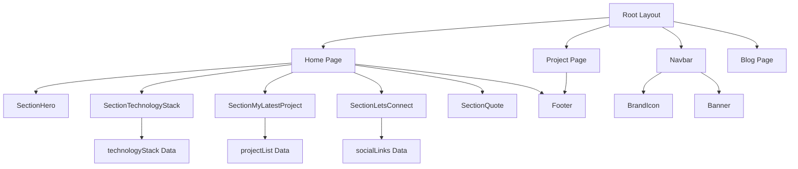

# Blockchain Portfolio - Agent Context

## SECTION 1: HIGH-LEVEL ARCHITECTURE

### Project Purpose
A modern, responsive portfolio website showcasing blockchain development projects, built with Next.js 13 App Router. Features animated sections, project showcases, technology stack display, and social media integration.

### Entry Points

1. **`[CMD]` Development Server**
   * **Description:** Starts Next.js development server on port 3000
   * **Location:** `package.json` : `L6`
   * **Command:** `npm run dev` or `yarn dev`

2. **`[CMD]` Production Build**
   * **Description:** Creates optimized production build
   * **Location:** `package.json` : `L7`
   * **Command:** `npm run build` or `yarn build`

3. **`[CMD]` Production Server**
   * **Description:** Starts production server
   * **Location:** `package.json` : `L8`
   * **Command:** `npm start` or `yarn start`

4. **`[ENTRY]` Root Layout**
   * **Description:** Main application layout with metadata, fonts, and global navigation
   * **Location:** `app/layout.tsx` : `L1-L24`
   * **URL:** `{{Base_URL}}/app/layout.tsx#L1-L24`

5. **`[ENTRY]` Home Page**
   * **Description:** Main landing page composing all section components
   * **Location:** `app/page.tsx` : `L1-L19`
   * **URL:** `{{Base_URL}}/app/page.tsx#L1-L19`

### Architecture Diagram



### Config & Environment

**Next.js Configuration:**
* **Location:** `next.config.js` : `L1-L4`
* **Current:** Empty default config (no custom settings)

**TypeScript Configuration:**
* **Location:** `tsconfig.json` : `L1-L31`
* **Path Aliases:**
  - `@/*` → `./*`
  - `@images/*` → `./assets/images/*`
  - `@fonts/*` → `./assets/fonts/*`
  - `@components/*` → `./components/*`

**Tailwind Configuration:**
* **Location:** `tailwind.config.js` : `L1-L26`
* **Custom Colors:**
  - `primary`: `#A293FF`
  - `secondary`: `#00F0FF`
  - `accent`: `#000000`
  - `accent2`: `#8E8E8E`
  - `gray`: `#F1F1F1`
* **Custom Fonts:**
  - `montserrat`: CSS variable `--font-montserrat`
  - `poppins`: CSS variable `--font-poppins`

**PostCSS Configuration:**
* **Location:** `postcss.config.js`
* **Plugins:** Autoprefixer, Tailwind CSS

---

## SECTION 2: LOW-LEVEL DICTIONARY (The "API")

### Core Components

#### `[COMPONENT] Navbar`
* **Signature:** `export default function Navbar(): JSX.Element`
* **Purpose:** Responsive navigation bar with mobile hamburger menu, desktop menu, and resume link
* **Source:** `components/Navbar.tsx` : `L26-L184`
* **URL:** `{{Base_URL}}/components/Navbar.tsx#L26-L184`
* **Dependencies:**
  - `BrandIcon` component
  - `Banner` component (commented out)
  - `usePathname` from `next/navigation`
  - `react-icons/rx` (RxCaretRight)
  - `react-icons/bs` (BsFileEarmarkPerson)
* **State:**
  - `isMenuOpen`: boolean - Controls mobile menu visibility
  - `triggerMenuRef`: Ref for hamburger checkbox
  - `navbarRef`: Ref for navbar element

#### `[COMPONENT] Footer`
* **Signature:** `export default function Footer()`
* **Purpose:** Simple footer with copyright notice
* **Source:** `components/Footer.tsx` : `L1-L13`
* **URL:** `{{Base_URL}}/components/Footer.tsx#L1-L13`

#### `[COMPONENT] BrandIcon`
* **Signature:** `export default function BrandIcon()`
* **Purpose:** Displays brand logo image
* **Source:** `components/BrandIcon.tsx` : `L1-L15`
* **URL:** `{{Base_URL}}/components/BrandIcon.tsx#L1-L15`
* **Assets:** Uses `assets.home.logo.jovian`

#### `[COMPONENT] Banner`
* **Signature:** `export default function Banner()`
* **Purpose:** Dismissible banner component (currently unused in Navbar)
* **Source:** `components/Banner.tsx` : `L1-L23`
* **URL:** `{{Base_URL}}/components/Banner.tsx#L1-L23`

### Section Components

#### `[COMPONENT] SectionHero`
* **Signature:** `export default function SectionHero(): JSX.Element`
* **Purpose:** Hero section with animated avatar and decorative geometric shapes
* **Source:** `app/SectionHero.tsx` : `L18-L152`
* **URL:** `{{Base_URL}}/app/SectionHero.tsx#L18-L152`
* **Features:**
  - Intersection Observer for scroll-triggered animations
  - Framer Motion animations
  - Responsive image sizing
  - Animated decorative images (zigZag, twistedTorus, quadrilateral, triangle)

#### `[COMPONENT] SectionTechnologyStack`
* **Signature:** `export default function SectionTechnologyStack()`
* **Purpose:** Displays technology stack icons with hover effects and links
* **Source:** `app/SectionTechnologyStack.tsx` : `L69-L125`
* **URL:** `{{Base_URL}}/app/SectionTechnologyStack.tsx#L69-L125`
* **Data:** `technologyStack` array (L11-L67)
* **Technologies:** Next.js, Laravel, Expo, Prisma, Express.js, PlanetScale, JavaScript, React.js, Tailwind CSS, React Native, TypeScript

#### `[COMPONENT] SectionMyLatestProject`
* **Signature:** `export default function SectionMyLatestProject()`
* **Purpose:** Showcases latest projects with tab navigation and project cards
* **Source:** `app/SectionMyLatestProject.tsx` : `L144-L328`
* **URL:** `{{Base_URL}}/app/SectionMyLatestProject.tsx#L144-L328`
* **Exports:** `projectList` array (L16-L129)
* **Features:**
  - Tab-based filtering (Project, More)
  - Project cards with hover effects
  - Links to repository and demo URLs
  - URL parameter-based tab state (`?tab=0`)

#### `[COMPONENT] SectionLetsConnect`
* **Signature:** `export default function SectionLetsConnect()`
* **Purpose:** Social media connection section with animated avatar and social links
* **Source:** `app/SectionLetsConnect.tsx` : `L20-L138`
* **URL:** `{{Base_URL}}/app/SectionLetsConnect.tsx#L20-L138`
* **Social Links:**
  - LinkedIn, Instagram, GitHub, Twitter, Email
* **Features:**
  - Absolute positioned social icons (desktop)
  - Grid layout for mobile
  - Animated background pulse effect

#### `[COMPONENT] SectionQuote`
* **Signature:** `export default function SectionQuote()`
* **Purpose:** Quote section with creator message and decorative floating images
* **Source:** `app/SectionQuote.tsx` : `L13-L99`
* **URL:** `{{Base_URL}}/app/SectionQuote.tsx#L13-L99`
* **Features:**
  - Custom font (Suarte) for signature
  - Floating animated images (teaCup, bulb, paintKit, heart)

### Page Components

#### `[PAGE] Home`
* **Signature:** `export default function Home()`
* **Purpose:** Main landing page composing all sections
* **Source:** `app/page.tsx` : `L8-L19`
* **URL:** `{{Base_URL}}/app/page.tsx#L8-L19`
* **Layout:** Wrapped in `safe-layout` container

#### `[PAGE] Project`
* **Signature:** `export default function Project()`
* **Purpose:** Project showcase page with grid layout of all projects
* **Source:** `app/project/page.tsx` : `L86-L236`
* **URL:** `{{Base_URL}}/app/project/page.tsx#L86-L236`
* **Features:**
  - Grid layout (4 columns mobile, 8 tablet, 12 desktop)
  - Project cards with tech stack badges
  - Links to demo and repository
  - Uses `projectList` from `SectionMyLatestProject`

#### `[PAGE] Blog`
* **Signature:** `export default function Blog()`
* **Purpose:** Blog page (under development placeholder)
* **Source:** `app/blog/page.tsx` : `L1-L10`
* **URL:** `{{Base_URL}}/app/blog/page.tsx#L1-L10`

#### `[LAYOUT] RootLayout`
* **Signature:** `export default function RootLayout({ children }: { children: React.ReactNode })`
* **Purpose:** Root layout with metadata, fonts, and global structure
* **Source:** `app/layout.tsx` : `L10-L23`
* **URL:** `{{Base_URL}}/app/layout.tsx#L10-L23`
* **Metadata:**
  - Title: "Jovian Dsouza"
  - Description: "Jovian Dsouza Portfolio"
* **Fonts:** Montserrat, Poppins (via CSS variables)

#### `[LAYOUT] ProjectLayout`
* **Signature:** `export default function ProjectLayout({ children }: { children: React.ReactNode })`
* **Purpose:** Layout wrapper for project pages with footer
* **Source:** `app/project/layout.tsx` : `L4-L15`
* **URL:** `{{Base_URL}}/app/project/layout.tsx#L4-L15`

### Data Structures

#### `[CONSTANT] assets`
* **Signature:** `export const assets = { home: { ... } }`
* **Purpose:** Centralized asset path definitions for images
* **Source:** `constant/assets.ts` : `L1-L53`
* **URL:** `{{Base_URL}}/constant/assets.ts#L1-L53`
* **Structure:**
  - `home.logo.jovian`
  - `home.hero.*` (avatar, decorative shapes)
  - `home.letsConnect.*` (social media icons, avatar)
  - `home.myLatestProject.*` (tab icons, project images)
  - `home.quote.*` (decorative images)
  - `home.technologyStack.*` (tech logos)

#### `[CONSTANT] fonts`
* **Signature:** `export const montserrat = Montserrat({ ... })`, `export const poppins = Poppins({ ... })`, `export const suarte = localFont({ ... })`
* **Purpose:** Font configuration using Next.js font optimization
* **Source:** `constant/font.ts` : `L1-L21`
* **URL:** `{{Base_URL}}/constant/font.ts#L1-L21`
* **Fonts:**
  - Montserrat: Google Font (weights 100-900)
  - Poppins: Google Font (weights 100-900)
  - Suarte: Local font (`assets/fonts/suarte/Suarte Free.ttf`)

#### `[DATA] projectList`
* **Signature:** `export const projectList = [...]`
* **Purpose:** Array of project objects with metadata
* **Source:** `app/SectionMyLatestProject.tsx` : `L16-L129`
* **URL:** `{{Base_URL}}/app/SectionMyLatestProject.tsx#L16-L129`
* **Structure:**
  ```typescript
  {
    slug: string;
    title: string;
    image: string;
    repositoryUrl?: string;
    demoUrl?: string;
  }
  ```

#### `[DATA] technologyStack`
* **Signature:** `const technologyStack = [...]`
* **Purpose:** Array of technology objects with logos and official sites
* **Source:** `app/SectionTechnologyStack.tsx` : `L11-L67`
* **URL:** `{{Base_URL}}/app/SectionTechnologyStack.tsx#L11-L67`
* **Structure:**
  ```typescript
  {
    name: string;
    image: string; // from assets
    officialSite: string;
  }
  ```

#### `[DATA] socialLinks`
* **Signature:** `const socialLinks = { ... }`
* **Purpose:** Social media URL mappings
* **Source:** `app/SectionLetsConnect.tsx` : `L12-L18`
* **URL:** `{{Base_URL}}/app/SectionLetsConnect.tsx#L12-L18`
* **Keys:** `linkedIn`, `instagram`, `github`, `twitter`, `mail`

### Styling

#### `[STYLE] globals.css`
* **Purpose:** Global CSS with Tailwind directives and custom utilities
* **Source:** `app/globals.css` : `L1-L100`
* **URL:** `{{Base_URL}}/app/globals.css#L1-L100`
* **Custom Utilities:**
  - `.safe-layout`: Max-width container (1440px)
  - `.safe-x-padding`: Responsive horizontal padding
  - `.gradient-text`: Gradient text effect
  - `.gradient-bg`: Gradient background
  - `.gradient-btn`: Animated gradient button
  - `.hamburger`: Mobile menu animation styles
  - `.no-scrollbar`: Hide scrollbar utility

#### `[STYLE] home.module.css`
* **Purpose:** CSS Module for home page section styles
* **Source:** `app/home.module.css` : `L1-L25`
* **URL:** `{{Base_URL}}/app/home.module.css#L1-L25`
* **Classes:**
  - `.sectionTitle`: Section heading style
  - `.sectionDescription`: Section description text
  - `.creatorQuotes`: Quote text style
  - `.creatorQuotesName`: Quote author name style
  - `.sectionDistance`: Vertical spacing between sections

### Configuration Files

#### `[CONFIG] package.json`
* **Purpose:** Project dependencies and scripts
* **Source:** `package.json` : `L1-L29`
* **URL:** `{{Base_URL}}/package.json#L1-L29`
* **Key Dependencies:**
  - `next`: 13.4.2
  - `react`: 18.2.0
  - `framer-motion`: ^10.12.10
  - `react-intersection-observer`: ^9.4.3
  - `react-icons`: ^4.8.0
  - `tailwindcss`: 3.3.2
  - `typescript`: 5.0.4

#### `[CONFIG] next.config.js`
* **Purpose:** Next.js configuration
* **Source:** `next.config.js` : `L1-L4`
* **URL:** `{{Base_URL}}/next.config.js#L1-L4`
* **Current:** Empty default configuration

#### `[CONFIG] tailwind.config.js`
* **Purpose:** Tailwind CSS configuration with custom theme
* **Source:** `tailwind.config.js` : `L1-L26`
* **URL:** `{{Base_URL}}/tailwind.config.js#L1-L26`
* **Content Paths:** `./pages/**/*`, `./components/**/*`, `./app/**/*`

#### `[CONFIG] tsconfig.json`
* **Purpose:** TypeScript compiler configuration
* **Source:** `tsconfig.json` : `L1-L31`
* **URL:** `{{Base_URL}}/tsconfig.json#L1-L31`
* **Path Mappings:** Defined for `@/*`, `@images/*`, `@fonts/*`, `@components/*`

### Interfaces & Types

#### `[INTERFACE] IAnimateImageProps`
* **Signature:** `interface IAnimateImageProps extends MotionProps { className: string; src: string; width: number; height: number; alt: string; }`
* **Purpose:** Type definition for animated image components with Framer Motion props
* **Source:** `app/SectionHero.tsx` : `L8-L14`
* **URL:** `{{Base_URL}}/app/SectionHero.tsx#L8-L14`

### Key Functions & Hooks

#### `[HOOK] useInView`
* **Purpose:** Intersection Observer hook for scroll-triggered animations
* **Usage:** Used in all section components
* **Package:** `react-intersection-observer`
* **Common Pattern:**
  ```typescript
  const { ref, inView } = useInView({
    threshold: 0.1,
    triggerOnce: true,
  });
  ```

#### `[HOOK] usePathname`
* **Purpose:** Get current route pathname for active link styling
* **Usage:** `components/Navbar.tsx` : `L31`
* **Package:** `next/navigation`

#### `[HOOK] useRouter`
* **Purpose:** Programmatic navigation
* **Usage:** `app/SectionMyLatestProject.tsx` : `L152`
* **Package:** `next/navigation`

### Animation Patterns

**Framer Motion Usage:**
- All section components use `motion` components from `framer-motion`
- Common animation pattern: `initial`, `animate`, `transition` props
- Scroll-triggered animations via `useInView` hook
- Hover effects: `whileHover`, `whileTap`

**Common Animation Props:**
- `initial: { opacity: 0, y: 100 }`
- `animate: inView ? { opacity: 1, y: 0 } : {}`
- `transition: { duration: 0.5, delay: 0.2 }`

---

## SECTION 3: FILE STRUCTURE REFERENCE

### Directory Tree
```
blockchain-portfolio/
├── app/                    # Next.js App Router pages
│   ├── layout.tsx          # Root layout
│   ├── page.tsx            # Home page
│   ├── globals.css         # Global styles
│   ├── home.module.css     # Section styles
│   ├── Section*.tsx        # Section components
│   ├── blog/
│   │   └── page.tsx        # Blog page
│   └── project/
│       ├── layout.tsx      # Project layout
│       └── page.tsx        # Project showcase
├── components/             # Reusable components
│   ├── Navbar.tsx
│   ├── Footer.tsx
│   ├── BrandIcon.tsx
│   └── Banner.tsx
├── constant/               # Constants and configs
│   ├── assets.ts          # Asset paths
│   └── font.ts            # Font configurations
├── assets/                 # Static assets
│   ├── fonts/             # Local fonts
│   └── images/            # Image assets
├── public/                 # Public static files
│   ├── projects/          # Project images
│   └── resume/            # Resume PDF
└── [config files]         # package.json, tsconfig.json, etc.
```

---

## SECTION 4: DEVELOPMENT WORKFLOW

### Adding a New Project
1. Add project object to `projectList` array in `app/SectionMyLatestProject.tsx` (L16-L129)
2. Add project image to `public/projects/` directory
3. Project will automatically appear in both home section and project page

### Adding a New Technology
1. Add technology object to `technologyStack` array in `app/SectionTechnologyStack.tsx` (L11-L67)
2. Add technology logo image to `assets/images/home/technologyStack/`
3. Import and reference in `constant/assets.ts`

### Styling Guidelines
- Use Tailwind utility classes for most styling
- Custom utilities defined in `app/globals.css`
- CSS Modules for component-specific styles (`home.module.css`)
- Responsive breakpoints: `md:` (768px), `lg:` (1024px), `xl:` (1280px)

### Animation Guidelines
- Use `useInView` hook for scroll-triggered animations
- Wrap animated elements with `motion` components from Framer Motion
- Stagger animations using `delay: index * 0.1` pattern
- Use `triggerOnce: true` for performance optimization

---

## SECTION 5: DEPENDENCIES & TECHNOLOGIES

### Core Framework
- **Next.js 13.4.2**: React framework with App Router
- **React 18.2.0**: UI library
- **TypeScript 5.0.4**: Type safety

### Styling
- **Tailwind CSS 3.3.2**: Utility-first CSS framework
- **PostCSS 8.4.23**: CSS processing
- **Autoprefixer 10.4.14**: CSS vendor prefixing

### Animation & Interactions
- **Framer Motion ^10.12.10**: Animation library
- **React Intersection Observer ^9.4.3**: Scroll detection

### Icons & Assets
- **React Icons ^4.8.0**: Icon library
- **Next.js Image**: Optimized image component

### Development Tools
- **ESLint 8.40.0**: Code linting
- **eslint-config-next 13.4.2**: Next.js ESLint config
